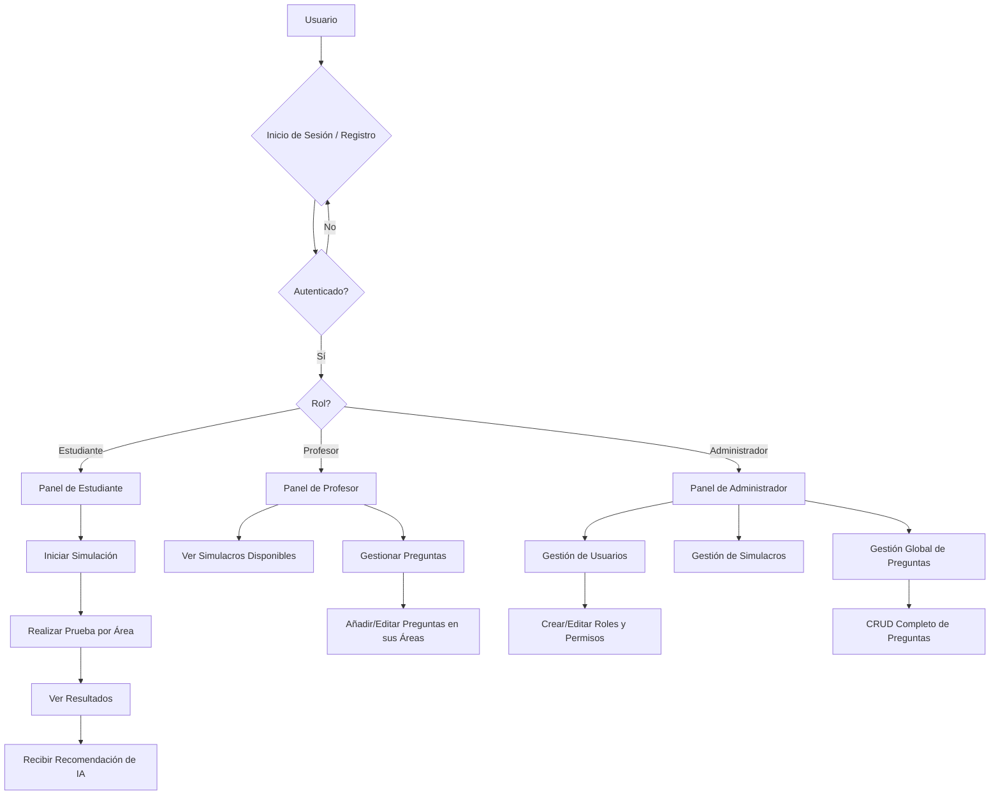

# Simulacro Pruebas Saber Pro - Frontend

Este repositorio contiene el código fuente del frontend para la plataforma de simulacros de las pruebas Saber Pro. La aplicación está diseñada para ofrecer una experiencia interactiva y educativa a estudiantes, con herramientas de gestión para profesores y administradores.

## Descripción del Proyecto

La plataforma permite a los estudiantes realizar simulacros de las pruebas Saber Pro en 5 áreas de conocimiento. Un sistema de IA analiza los resultados para proveer recomendaciones personalizadas y ayudar a los estudiantes a mejorar. Los profesores pueden gestionar las preguntas de las áreas, y los administradores tienen control total sobre usuarios, roles y contenido de los simulacros.

## Diagrama de Flujo de Usuario



## Características Principales

### Para Estudiantes
- **Panel de Inicio:** Vista rápida de estadísticas y simulacros recientes.
- **Realización de Simulacros:** Pruebas cronometradas por áreas de conocimiento.
- **Resultados Detallados:** Visualización de respuestas correctas e incorrectas.
- **Medidor de Desempeño:** Gráficos que muestran el rendimiento histórico.
- **Recomendaciones con IA:** Feedback personalizado basado en el puntaje obtenido para enfocar el estudio.

### Para Profesores
- **Gestión de Preguntas:** Añadir y editar preguntas dentro de las categorías asignadas.
- **Visualización de Simulacros:** Acceso a los bancos de preguntas y simulacros existentes.
- **Seguimiento (Futuro):** Posibilidad de ver el progreso de sus estudiantes.

### Para Administradores
- **Dashboard General:** Métricas clave de la plataforma.
- **Gestión de Usuarios:** Crear, ver, editar y eliminar cualquier usuario. Asignación de roles.
- **Gestión de Contenido:** Control total (CRUD) sobre las preguntas, categorías y simulacros.

## Stack Tecnológico

- **Framework:** React 18+
- **Build Tool:** Vite
- **Estilos:** Tailwind CSS
- **Comunicación API:** Axios (configurado en `src/api/axiosInstance.jsx`)
- **Gestión de Estado:** React Context API (ver `src/context/SimulationContext.jsx`)
- **Routing:** React Router DOM
- **Linting:** ESLint

## Estructura del Proyecto

El código fuente se encuentra en el directorio `src/` y está organizado de la siguiente manera:

```
/src
├───api/              # Configuración central de Axios para la comunicación con el backend.
├───assets/           # Imágenes, logos y otros recursos estáticos.
├───components/       # Componentes reutilizables de la UI.
│   ├───dashboard/    # Componentes específicos del panel de control.
│   ├───layout/       # Estructuras principales (Sidebar, Layouts por rol).
│   ├───questions/    # Componentes para mostrar y gestionar preguntas.
│   ├───simulation/   # Componentes para la experiencia del simulacro (Timer, etc.).
│   └───ui/           # Componentes genéricos de UI (Botones, Modales, Cards).
├───context/          # Contexto de React para la gestión del estado global (ej. estado del simulacro).
├───data/             # Datos estáticos o mockups.
├───pages/            # Vistas principales de la aplicación, organizadas por rol.
│   ├───admin/
│   ├───auth/
│   ├───student/
│   └───teacher/
├───routes/           # Definición de las rutas de la aplicación y protección por roles.
└───style/            # Archivos de estilos globales como index.css.
```

## Instalación y Puesta en Marcha

1.  **Clonar el repositorio:**
    ```bash
    git clone <URL_DEL_REPOSITORIO>
    cd frontend
    ```

2.  **Instalar dependencias:**
    Se recomienda usar `bun` por la presencia de `bun.lock`, pero `npm` también es compatible.
    ```bash
    bun install
    # o si usas npm
    npm install
    ```

3.  **Configurar variables de entorno:**
    Crea un archivo `.env` en la raíz de `/frontend` a partir del ejemplo `.env.example` (si existiera) o créalo desde cero. Debe contener la URL del backend.
    ```
    VITE_API_URL=http://localhost:3000/api
    ```

4.  **Ejecutar el servidor de desarrollo:**
    ```bash
    bun run dev
    # o si usas npm
    npm run dev
    ```
    La aplicación estará disponible en `http://localhost:5173` (o el puerto que indique Vite).

## Scripts Disponibles

-   `npm run dev`: Inicia el servidor de desarrollo con Vite.
-   `npm run build`: Compila la aplicación para producción.
-   `npm run lint`: Ejecuta el linter (ESLint) para revisar la calidad del código.

## Integración con el Backend

El frontend se comunica con un backend Node.js/Express a través de una API REST. La instancia de Axios preconfigurada en `src/api/axiosInstance.jsx` gestiona las peticiones, incluyendo el envío del token de autenticación en los headers.

**Endpoints Principales Consumidos:**
-   `/api/auth/login`, `/api/auth/register`: Autenticación de usuarios.
-   `/api/users`: (Admin) Gestión de usuarios.
-   `/api/questions`: (Admin, Profesor) CRUD de preguntas.
-   `/api/categories`: (Admin) CRUD de categorías.
-   `/api/tests`: (Todos) Gestión y realización de simulacros.
-   `/api/ai/recommendation`: (Estudiante) Obtención de recomendaciones post-simulacro.

## Estado Actual y Trabajo Futuro

### Implementado

La mayor parte de la funcionalidad principal de la aplicación ya está desarrollada y es funcional, incluyendo:

-   **Flujo de Autenticación:** Registro e inicio de sesión para los tres roles (Administrador, Profesor, Estudiante).
-   **Funcionalidad por Rol:** Todas las capacidades descritas en la sección de características para cada rol están implementadas.
-   **Simulacros Completos:** Los estudiantes pueden realizar simulacros de principio a fin, incluyendo la selección de respuestas, el cronómetro y la finalización de la prueba.
-   **Integración con Backend:** La comunicación con la API está establecida para todas las funcionalidades existentes.
-   **Recomendaciones con IA:** El sistema procesa los resultados y muestra las recomendaciones generadas por la IA al estudiante.
-   **Manejo de Estados:** La aplicación gestiona los estados de carga y error durante las interacciones.

### Pendiente / Por Hacer

El trabajo restante se centra en funcionalidades específicas y mejoras de calidad:

-   **Historial de Calificaciones:** Implementar la página `CalificacionesPage.jsx` para que los estudiantes puedan ver un historial de los resultados de todos sus simulacros anteriores.
-   **Recuperación de Contraseña:** Añadir un flujo para que los usuarios puedan restablecer su contraseña si la olvidan.
-   **Pruebas y QA:** Realizar un ciclo de pruebas unitarias y de integración para asegurar la robustez y estabilidad de la aplicación antes del despliegue.
-   **Refinamiento Final de UI/UX:** Realizar ajustes menores en la interfaz para mejorar la experiencia de usuario general.

---
## Licencia

Repositorio Privado. Todos los derechos reservados.
